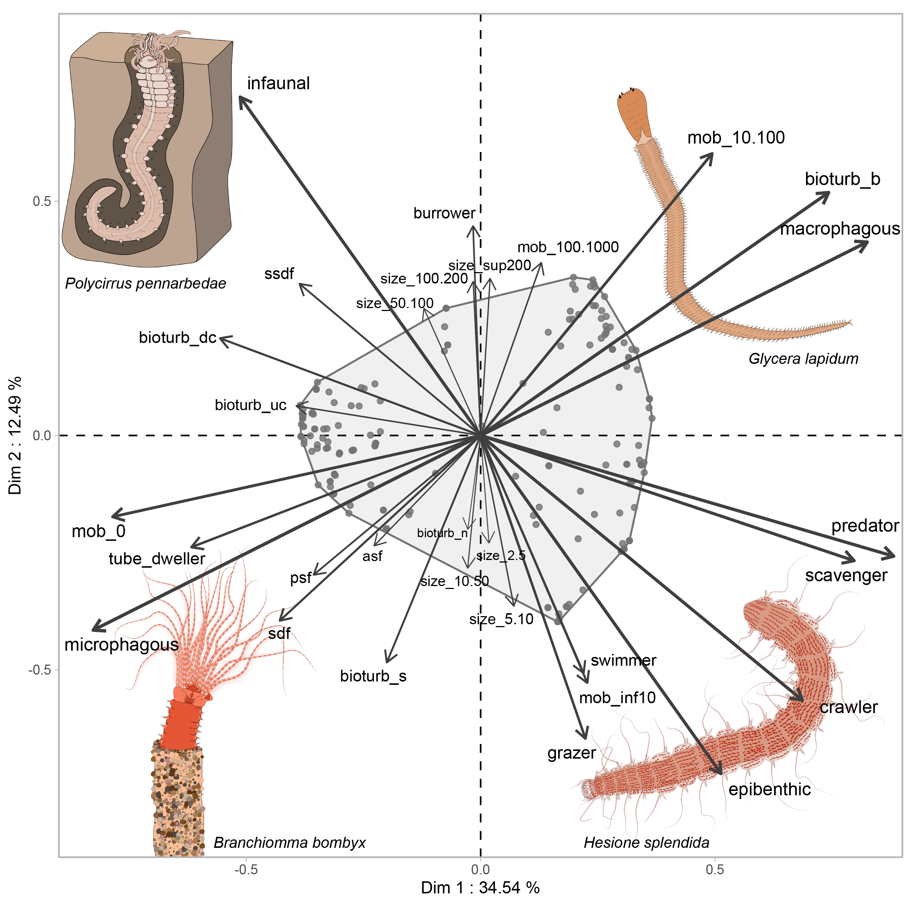

<!-- README.md is generated from README.Rmd. Please edit that file -->

# Jardim et al. (2026). Trait-based insights into complexity–diversity relationships: different habitat complexity components drive niche diversity and community size. Hydrobiologia. Data and Supplementary Information 

<!-- badges: start -->

<!-- badges: end -->

This is the research compendium containing all analysis in Jardim et
al. (2026): **Trait-based insights into complexity–diversity
relationships:** *different habitat complexity components drive niche
diversity and community size.*

## Running the code

You can run all analysis and generate the Supplemental Information html
file only by sourcing the make.R file once you have forked the
compendium.  
Please note that the original 3D meshes cannot be uploaded to GitHub due
to their large file size (1080 meshes. = 90gb). You can contact the
authors to get the 3D meshes. If you do, check all the necessary
dependencies for running 3D mesh analysis in R, detailed in:
<https://github.com/zarquon42b/Morpho>.

## Code of Conduct

Please note that this project is released with a [Contributor Code of
Conduct](https://contributor-covenant.org/version/2/0/CODE_OF_CONDUCT.html).
By contributing to this project, you agree to abide by its terms.
